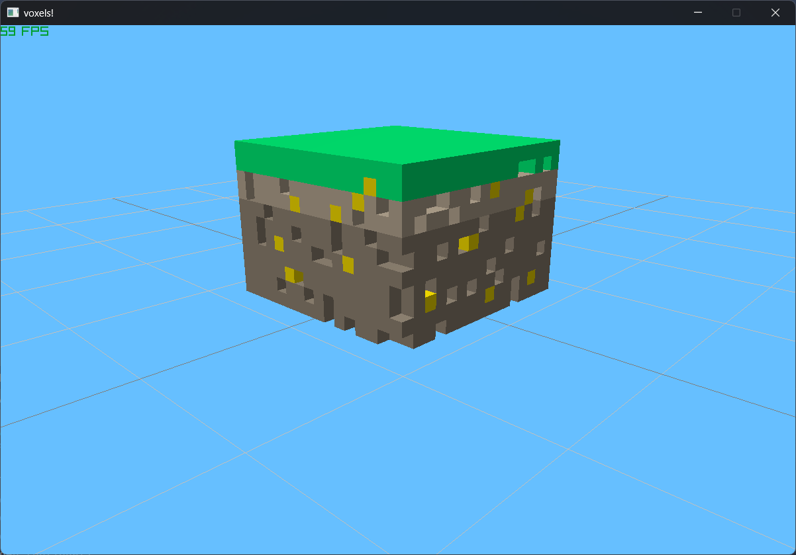

# Voxel Mesher
## Port of raylib-extras' [voxel mesher example](https://github.com/raylib-extras/examples-cpp/tree/main/voxel_mesher) to Raylib-CSharp-Vinculuum (because Raylib-CsLo is dead)
An example of how to create meshes for a voxel chunk similar to what may be used in block games (minecrafts)

# Building
To build you need .NET ~~6.0~~ 7.0 SDK
